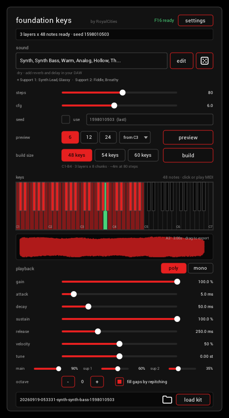

# Foundation Keys

A free, open-source instrument (VST3, CLAP, standalone) that turns a text prompt into a playable keyboard
with RoyalCities' **[Foundation-1.2](https://huggingface.co/RoyalCities/Foundation-1)** Keybeds model,
running locally through **[sa3.cpp](https://github.com/betweentwomidnights/sa3.cpp)**.



**Lineage**
- model: [RoyalCities/Foundation-1](https://huggingface.co/RoyalCities/Foundation-1) (Foundation-1.2 Keybeds)
- upstream: [RoyalCities/RC-stable-audio-tools](https://github.com/RoyalCities/RC-stable-audio-tools), the keybed recipe this follows
- inference: [sa3.cpp](https://github.com/betweentwomidnights/sa3.cpp) (ggml; CUDA, Vulkan, Metal)
- GGUFs: [thepatch/foundation-1.2-keybeds-GGUF](https://huggingface.co/thepatch/foundation-1.2-keybeds-GGUF)
- framework: [iPlug2 fork](https://github.com/betweentwomidnights/iPlug2) (`sa3-demo-tempo` branch)

## How it works

Describe a sound (or roll the dice), preview six notes, then build a 48-60 key keyboard. Following
RoyalCities' recipe, each 20 s pass renders six chromatic notes with one shared seed; the notes are sliced
into 3 s samples, one per key, and become playable as each pass lands. Up to two **support layers**
(`edit` > `+ layer`) render after the main one and mix at playback, at RC's volumes and seeds.

The model renders an octave below its prompt labels, so keys are mapped by sounding pitch (MIDI 60 plays
middle C). Kits save to `Documents/Foundation Keys/kits` as WAVs plus a `kit.sfz`; drag a note or a kit
out of the plugin to use it elsewhere.

## Models

Settings downloads a tier from Hugging Face (resumable) into `%LOCALAPPDATA%\Foundation Keys\models`
(`~/Library/Application Support/Foundation Keys/models` on macOS), or points at a folder that has one:
F16 2.5 GB, Q8_0 1.4 GB, Q5_K_M 1.0 GB, Q4_K_M 0.9 GB.

## Build

Clone this repo and sa3.cpp side by side, then build libsa3 with SAT (Foundation) support:

```
git clone --recurse-submodules https://github.com/betweentwomidnights/foundation-1.2-iplug2.git
git clone https://github.com/betweentwomidnights/sa3.cpp.git
cd sa3.cpp && build.cmd cuda          # or: build.cmd vulkan / ./build.sh metal
```

Fetch the iPlug2 SDKs (git-bash on Windows), then build the plugin:

```
cd foundation-1.2-iplug2/vendor/iPlug2/Dependencies/IPlug && ./download-iplug-sdks.sh && ./download-clap-sdks.sh
cd ../../../..
cmake -S . -B build -DSA3_BUILD_DIR=../sa3.cpp/build-cuda      # or build-vulkan / build-metal
cmake --build build --config Release --target FoundationKeys-vst3 FoundationKeys-clap FoundationKeys-app
```

The backend's runtime libraries are copied beside the plugin; libsa3 loads on first render, never at plugin
scan. For release builds, build sa3.cpp with `-DGGML_NATIVE=OFF` (portable CPU code and CUDA architectures)
and configure this repo with `-DFOUNDATION_KEYS_DEV_MODELS=OFF`.

`build/out-test/Release/FoundationKeysEngineTest.exe <models dir>` renders through libsa3 and checks pitch,
layers, mono/poly, headroom, kit reload, and cancel.

## License

Foundation-1.2 weights: Stability AI Community License (see the model card). The T5 encoder is Apache-2.0.
